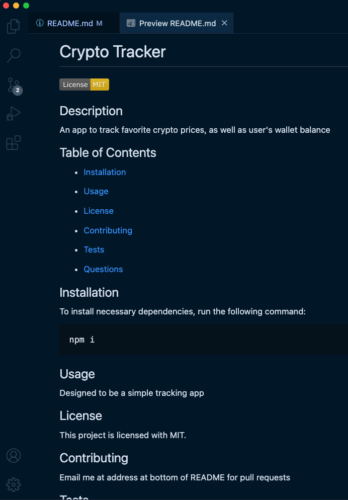

# README Generator

Testing for changes

This is a command-line script program that generates a README.md file based on the user's inputs.

[Click to watch a walkthrough video](https://youtu.be/oABhQ5CuLTI)

This app is designed to create a professional-looking README file for a user's repository.

When the user navigates to the Develop folder in their terminal, they enter 'node index.js' to begin the script.

They are asked to input their Github name, Email, Project title, Description, and Installation and Usage instructions, as well as choose a License from a list.

After they have completed all of the prompts the program creates a README file in the develop folder for them.

